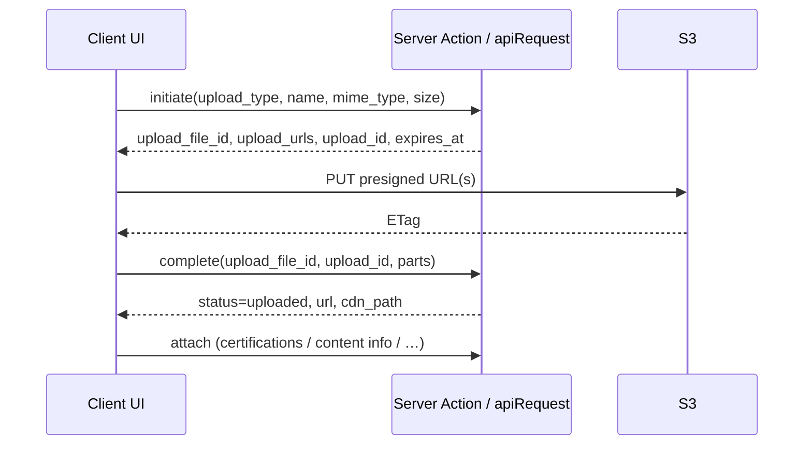

# Image Upload (RealRead API)

Source of truth: [.docs/fe-handoff/image-upload.md](../../../.docs/fe-handoff/image-upload.md)

Also use [backend-api](../backend-api/SKILL.md) for Bearer auth, envelope, and error codes.

## Critical rules

| Rule                    | Detail                                                            |
| ----------------------- | ----------------------------------------------------------------- |
| No multipart to Laravel | File bytes go **directly to S3** via presigned URL                |
| S3 PUT                  | **No** `Authorization: Bearer` — only `Content-Type: {mime_type}` |
| ETag                    | Keep **exact** value from S3 header (quotes included): `"abc123"` |
| ID for attach           | Use `upload_file_id` (UUID), not CDN `url`                        |
| Client validate first   | `image/*` MIME, size `1 … 10_485_760` bytes (10 MB)               |
| Part size               | `10 * 1024 * 1024` — must match `upload_urls.length`              |

## 4-step flow

```
1. POST /api/v1/upload-files          (JSON metadata, Bearer)
2. PUT each presigned url             (binary, browser → S3)
3. POST /api/v1/upload-files/{id}/complete  (upload_id + parts[{part_number, etag}])
4. Attach upload_file_id              (resource-specific PUT — not automatic)
```



## Upload types & attach

| `upload_type`           | Who            | After complete                                                          |
| ----------------------- | -------------- | ----------------------------------------------------------------------- |
| `profile_certification` | Creator        | `PUT /profile/certifications` → `upload_file_id` on item                |
| `content_cover`         | Creator        | `PUT /contents/{id}/info` → `cover_upload_file_id`                      |
| `general`               | Reader/Creator | Insert `data.url` in HTML — no attach                                   |
| `profile_avatar`        | Reader/Creator | ⚠️ Upload works; `PUT /profile` **no attach field yet**                 |
| `profile_cover`         | Reader/Creator | ⚠️ Same gap — see [known-gaps](../../../.docs/fe-handoff/known-gaps.md) |

Remove certification image: sync item with `"upload_file_id": null`.

## Project placement

| Layer          | Path                                             | Responsibility                                          |
| -------------- | ------------------------------------------------ | ------------------------------------------------------- |
| Types          | `src/core/api/types/upload.ts`                   | `InitiateUploadPayload`, `UploadFileInitiated`, …       |
| Enums          | `src/core/api/types/enums.ts`                    | `UploadType`                                            |
| Endpoints      | `src/core/api/endpoints/upload.ts`               | `initiateUpload`, `completeUpload` via `apiRequest`     |
| S3 client      | `src/core/api/lib/upload-image-client.ts`        | **Browser only**: split file, PUT parts, collect ETags  |
| Feature hook   | `src/features/{feature}/hooks/useUploadImage.ts` | Orchestrate initiate (SA) → S3 → complete (SA) → attach |
| Server Actions | `src/features/{feature}/actions/`                | Initiate/complete/attach with `requireApiSession()`     |

**Split server vs browser:**

- `apiRequest` + Bearer → Server Actions / RSC only (`@/core/api/server`)
- S3 `PUT` → **client component** (presigned URL fetch from browser)

Do **not** import `next/headers` or `getServerAccessToken` in the S3 upload module.

## Implementation checklist

```
- [ ] Zod validate File client-side (MIME, max 10 MB) before initiate
- [ ] Server Action: initiate → return initiated payload to client
- [ ] Client: upload parts to S3, collect ETags
- [ ] Server Action: complete with upload_id + parts
- [ ] Server Action or existing action: attach upload_file_id to resource
- [ ] Loading + error UI; optional progress (parts done / total)
- [ ] revalidatePath for affected pages after attach
- [ ] i18n messages EN + JA for errors
```

## UI patterns

- **Before initiate**: reject non-images and oversize files locally
- **During upload**: disable submit; show spinner or part progress
- **Retry**: S3 PUT fail → retry that part; `upload.expired` (410) → initiate from scratch
- **Profile settings avatar/cover**: UI only until BE adds `PUT /profile` attach fields — do not fake-update `avatar_url`

## Error handling

Map `error.code` — full table: [errors.md](errors.md)

| Code                   | Action                          |
| ---------------------- | ------------------------------- |
| `upload.expired`       | Re-initiate                     |
| `upload.invalid_parts` | Fix split / ETag                |
| `upload.access_denied` | Hide upload for role            |
| `validation_error`     | Map `details[]` to form fields  |
| `upload.not_ready`     | Wait for complete before attach |

## Use-case recipes

### Certification image

1. `upload_type: 'profile_certification'`
2. Complete upload
3. `PUT /profile/certifications` with full sync list including `upload_file_id`
4. Display `image_url` from response

### Content cover

1. `upload_type: 'content_cover'`
2. Complete upload
3. `PUT /contents/{id}/info` with `cover_upload_file_id`

### Inline editor image

1. `upload_type: 'general'`
2. Complete upload
3. Insert `data.url` into editor HTML

## Reference code

Full TypeScript service sample: [.docs/fe-handoff/image-upload.md#reference-implementation](../../../.docs/fe-handoff/image-upload.md#reference-implementation)

Minimal client S3 helper shape:

```typescript
const PART_SIZE = 10 * 1024 * 1024;

export async function uploadPartsToS3(
  file: File,
  uploadUrls: { part_number: number; url: string }[]
): Promise<{ part_number: number; etag: string }[]> {
  const blobs: Blob[] = [];
  for (let offset = 0; offset < file.size; offset += PART_SIZE) {
    blobs.push(file.slice(offset, offset + PART_SIZE));
  }
  if (blobs.length !== uploadUrls.length) {
    throw new Error("Part count mismatch");
  }
  return Promise.all(
    uploadUrls.map(async (part) => {
      const res = await fetch(part.url, {
        method: "PUT",
        headers: { "Content-Type": file.type },
        body: blobs[part.part_number - 1],
      });
      if (!res.ok) throw new Error(`S3 upload failed: ${res.status}`);
      const etag = res.headers.get("ETag");
      if (!etag) throw new Error("S3 response missing ETag");
      return { part_number: part.part_number, etag };
    })
  );
}
```

## Related

- Handoff: [.docs/fe-handoff/image-upload.md](../../../.docs/fe-handoff/image-upload.md)
- Endpoints list: [.docs/fe-handoff/endpoints.md](../../../.docs/fe-handoff/endpoints.md)
- API client patterns: [backend-api](../backend-api/SKILL.md)
- Form file validation (legacy 5MB pattern — **override with 10 MB** for this API): [form-patterns/file-upload.md](../form-patterns/file-upload.md)
