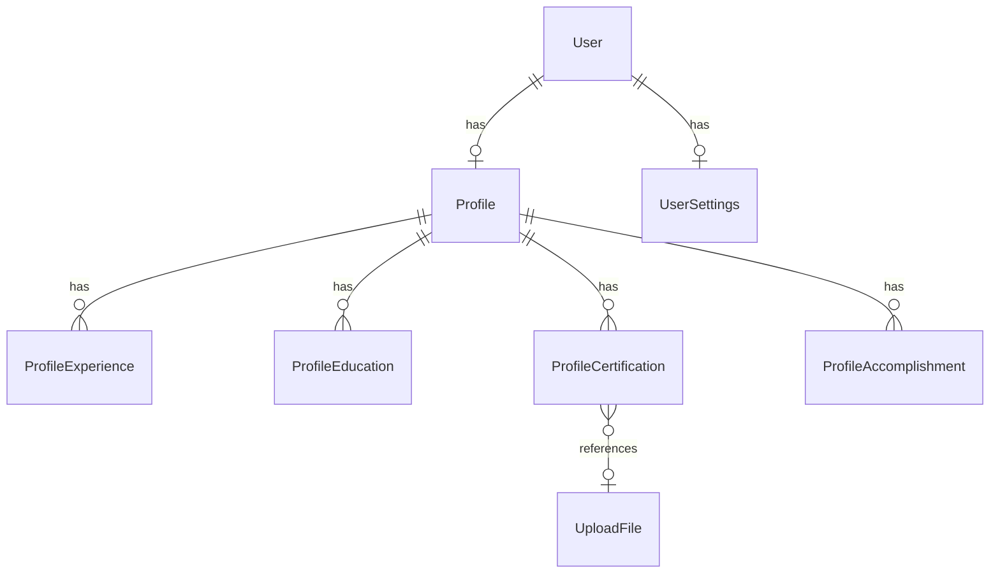

# Enums & Entities

## Enums

### UserRole

| Value     | Description                |
| --------- | -------------------------- |
| `reader`  | Người đọc                  |
| `creator` | Người tạo nội dung         |
| `admin`   | Quản trị (admin SPA riêng) |
| `staff`   | Nhân viên nội bộ           |

### UserStatus

| Value    |
| -------- |
| `active` |
| `banned` |

### ExpertStatus

| Value      |
| ---------- |
| `none`     |
| `pending`  |
| `approved` |
| `rejected` |

### OnboardingStep

| Value             | Mô tả                    |
| ----------------- | ------------------------ |
| `account_created` | Vừa đăng ký              |
| `profile_basic`   | Đang điền profile cơ bản |
| `completed`       | Hoàn tất onboarding      |

### ClientType

| Value    | Token TTL |
| -------- | --------- |
| `web`    | 24 giờ    |
| `mobile` | 7 ngày    |

### AccomplishmentType (creator profile)

| Value         |
| ------------- |
| `project`     |
| `publication` |
| `patent`      |
| `award`       |
| `course`      |

### UploadType (upload-files)

| Value                   |
| ----------------------- |
| `profile_avatar`        |
| `profile_cover`         |
| `profile_certification` |
| `content_cover`         |
| `general`               |

---

## Entity relationships

## API entities (phase 1)

### User

Trả về từ `GET /auth/me`, nested trong login/register response.

### Profile

Trả về từ `GET/PUT /profile`. Field khác nhau theo role:

- **Reader/Creator:** đầy đủ social, onboarding, `is_public`
- **Creator:** thêm nested `experiences`, `educations`, `certifications`, `accomplishments` khi load
- **Staff:** subset (không có social URLs, `is_public`)

### UserSettings

Trả về từ `GET/PUT /profile/settings`. Chỉ **reader** và **creator**.

### Profile sub-resources

Chỉ **creator**. `id` là **integer** (không phải UUID).

## DB tables (reference only)

| Table                     | Mục đích                            |
| ------------------------- | ----------------------------------- |
| `users`                   | Auth account                        |
| `profiles`                | Profile 1:1 user                    |
| `user_settings`           | App settings 1:1 user               |
| `profile_experiences`     | Work history                        |
| `profile_educations`      | Education                           |
| `profile_certifications`  | Certifications (+ `upload_file_id`) |
| `profile_accomplishments` | Awards, projects, …                 |
| `upload_files`            | File upload metadata (S3)           |

FE **không** cần mirror DB schema — dùng API types trong `types/domain-types.ts`.
