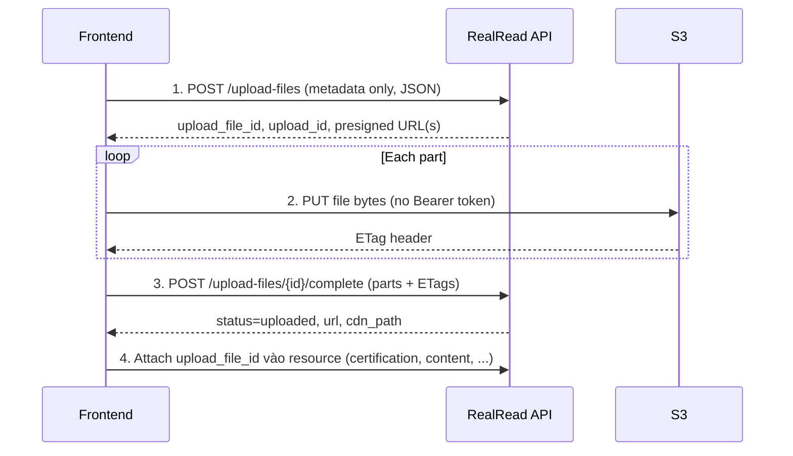

# Image Upload — Frontend Integration Guide

**API version:** `v1`  
**Last updated:** 2026-06-12

Hướng dẫn tích hợp upload ảnh cho Frontend, theo kiến trúc và flow của RealRead API.

> **Quan trọng:** RealRead **không** nhận file qua `multipart/form-data` trực tiếp lên Laravel. FE upload **thẳng lên S3** bằng presigned URL, sau đó gọi API complete. Pattern này khác với các endpoint CRUD thông thường trong [API Development Flow](../api-development-flow/api-development-flow.md).

---

## Contents

| Section                                                  | Description                        |
| -------------------------------------------------------- | ---------------------------------- |
| [Architecture](#architecture)                            | Tổng quan 3 bước + attach          |
| [Upload types & permissions](#upload-types--permissions) | `upload_type` và role được phép    |
| [Limits](#limits)                                        | Kích thước file, part size, TTL    |
| [Step 1 — Initiate](#step-1--initiate-upload)            | `POST /upload-files`               |
| [Step 2 — Upload to S3](#step-2--upload-parts-to-s3)     | `PUT` presigned URL(s)             |
| [Step 3 — Complete](#step-3--complete-upload)            | `POST /upload-files/{id}/complete` |
| [Step 4 — Attach](#step-4--attach-upload_file_id)        | Gắn file vào resource              |
| [TypeScript types](#typescript-types)                    | Copy từ `types/domain-types.ts`    |
| [Reference implementation](#reference-implementation)    | Service + helper mẫu               |
| [Error handling](#error-handling)                        | Codes thường gặp                   |
| [Use cases](#use-cases)                                  | Certification, content cover       |
| [Known gaps](#known-gaps)                                | Avatar/cover profile               |

---

## Architecture



**Request flow (BE):**

```
Client
  → routes/api.php          (auth:sanctum)
  → CreateUploadFileAction / CompleteUploadFileAction
      → UploadFileService
      → S3MultipartUploadClient (presigned URLs)
  → UploadFileInitiatedResource / UploadFileCompletedResource
```

**Điểm khác biệt so với CRUD thông thường:**

|                       | CRUD endpoint        | Upload endpoint                                     |
| --------------------- | -------------------- | --------------------------------------------------- |
| Body format           | `application/json`   | Initiate + Complete: `application/json`             |
| File gửi đâu?         | Không có file        | **Trực tiếp lên S3** (bước 2)                       |
| Auth bước upload file | Bearer token         | **Không** gửi Bearer lên S3                         |
| ID public             | `external_id` (UUID) | `upload_file_id` = `external_id` của `upload_files` |

---

## Upload types & permissions

| `upload_type`           | Ai được upload?                  | Gắn vào resource                                                     |
| ----------------------- | -------------------------------- | -------------------------------------------------------------------- |
| `profile_avatar`        | Reader / Creator (có profile)    | ⚠️ Chưa có field trên `PUT /profile` — xem [Known gaps](#known-gaps) |
| `profile_cover`         | Reader / Creator (có profile)    | ⚠️ Chưa có field — xem [Known gaps](#known-gaps)                     |
| `profile_certification` | Creator (có profile)             | ✅ `PUT /profile/certifications` → `upload_file_id`                  |
| `content_cover`         | Creator                          | ✅ `PUT /contents/{id}/info` → `cover_upload_file_id`                |
| `general`               | Reader / Creator / Admin / Staff | Chèn `url` vào HTML editor (inline image)                            |

Nếu role không đủ quyền → **403** `upload.access_denied`.

---

## Limits

| Constraint          | Value                        | Ghi chú                                       |
| ------------------- | ---------------------------- | --------------------------------------------- |
| Max file size       | **10 MB** (10_485_760 bytes) | Config: `UPLOAD_MAX_IMAGE_SIZE_BYTES`         |
| MIME type           | Phải bắt đầu bằng `image/`   | VD: `image/jpeg`, `image/png`, `image/webp`   |
| Multipart part size | **10 MB** / part             | File ≤ 10 MB → **1 part**                     |
| Presigned URL TTL   | **60 phút** (mặc định)       | Sau TTL → complete trả `upload.expired` (410) |

FE nên validate client-side **trước** khi gọi initiate (MIME, size) để tránh round-trip 422.

---

## Step 1 — Initiate upload

**Endpoint:** `POST /api/v1/upload-files`  
**Auth:** `Authorization: Bearer {token}`  
**Content-Type:** `application/json`

### Request body

```json
{
  "upload_type": "profile_certification",
  "name": "certificate.jpg",
  "mime_type": "image/jpeg",
  "size": 102400
}
```

| Field         | Type    | Required | Rules                                                          |
| ------------- | ------- | -------- | -------------------------------------------------------------- |
| `upload_type` | string  | ✅       | Một trong các giá trị [UploadType](#upload-types--permissions) |
| `name`        | string  | ✅       | Tên file gốc, max 255 ký tự                                    |
| `mime_type`   | string  | ✅       | Regex `^image/`, max 100                                       |
| `size`        | integer | ✅       | Bytes, `1` … `10485760`                                        |

### Success response — `201 Created`

```json
{
  "data": {
    "upload_file_id": "550e8400-e29b-41d4-a716-446655440000",
    "upload_id": "s3-multipart-upload-id",
    "upload_urls": [
      {
        "part_number": 1,
        "url": "https://bucket.s3.amazonaws.com/...?X-Amz-Signature=..."
      }
    ],
    "hash": "random-storage-hash",
    "name": "certificate.jpg",
    "expires_at": "2026-06-12T15:30:00+00:00"
  }
}
```

**Lưu lại:** `upload_file_id`, `upload_id`, `upload_urls`, `expires_at`.

---

## Step 2 — Upload parts to S3

Với mỗi entry trong `upload_urls`:

1. Cắt file thành chunk theo `part_number` (part 1 = bytes `0 … partSize-1`, part 2 = `partSize … 2*partSize-1`, …).
2. Gọi **`PUT`** tới `url` (presigned).
3. Đọc header **`ETag`** từ response S3.

### Request lên S3

```http
PUT {presigned_url}
Content-Type: image/jpeg

<binary bytes of this part>
```

**Không gửi:**

- `Authorization: Bearer ...` (S3 dùng query signature trong URL)
- `Content-Type: application/json`

**Phải gửi:**

- `Content-Type` trùng `mime_type` đã khai báo ở bước 1

### ETag

S3 trả `ETag` trong response header. Gửi nguyên giá trị đó sang bước complete — **thường có dấu ngoặc kép**, ví dụ `"a1b2c3d4"`.

```typescript
const etag = response.headers.get("ETag");
// etag === '"abc123..."'  ← giữ nguyên, không strip quotes
```

### Multipart splitting (file > 10 MB)

```typescript
const PART_SIZE = 10 * 1024 * 1024; // 10 MB — khớp BE config

function splitFileIntoParts(file: File): Blob[] {
  const parts: Blob[] = [];
  for (let offset = 0; offset < file.size; offset += PART_SIZE) {
    parts.push(file.slice(offset, offset + PART_SIZE));
  }
  return parts;
}
```

Số part BE trả về (`upload_urls.length`) phải khớp số chunk FE upload. Nếu lệch → **422** `upload.invalid_parts`.

---

## Step 3 — Complete upload

**Endpoint:** `POST /api/v1/upload-files/{upload_file_id}/complete`  
**Auth:** Bearer token  
**Content-Type:** `application/json`

`{upload_file_id}` = UUID từ bước 1 (`data.upload_file_id`).

### Request body

```json
{
  "upload_id": "s3-multipart-upload-id",
  "parts": [
    {
      "part_number": 1,
      "etag": "\"a1b2c3d4e5f6\""
    }
  ]
}
```

| Field                 | Type    | Required | Rules                                |
| --------------------- | ------- | -------- | ------------------------------------ |
| `upload_id`           | string  | ✅       | Phải khớp `data.upload_id` từ bước 1 |
| `parts`               | array   | ✅       | Min 1 item                           |
| `parts[].part_number` | integer | ✅       | ≥ 1, khớp thứ tự part đã upload      |
| `parts[].etag`        | string  | ✅       | ETag từ S3 PUT response              |

### Success response — `200 OK`

```json
{
  "data": {
    "upload_file_id": "550e8400-e29b-41d4-a716-446655440000",
    "status": "uploaded",
    "url": "https://cdn.example.com/public/{user_uuid}/{hash}/certificate.jpg",
    "cdn_path": "public/{user_uuid}/{hash}/certificate.jpg",
    "name": "certificate.jpg"
  }
}
```

- `status`: `uploaded` khi thành công
- `url`: URL public qua CDN (có thể `null` nếu BE chưa cấu hình `CDN_ROOT_URI`)
- Sau bước này, dùng **`upload_file_id`** (không phải `url`) để gắn vào resource

---

## Step 4 — Attach `upload_file_id`

Upload xong **chưa tự gắn** vào profile/content. FE phải gọi endpoint sync/update tương ứng.

### Certification (đã implement)

```http
PUT /api/v1/profile/certifications
Authorization: Bearer {token}
Content-Type: application/json
```

```json
{
  "certifications": [
    {
      "name": "AWS Solutions Architect",
      "issuing_organization": "Amazon",
      "issue_date": "2023-01-01",
      "upload_file_id": "550e8400-e29b-41d4-a716-446655440000",
      "sort_order": 0
    }
  ]
}
```

Response trả `image_url` (CDN) + `upload_file_id`.  
Xóa ảnh: gửi `"upload_file_id": null` khi sync lại item có `id`.

### Content cover (Creator)

```http
PUT /api/v1/contents/{content_id}/info
```

```json
{
  "title": "My Article",
  "cover_upload_file_id": "550e8400-e29b-41d4-a716-446655440000"
}
```

Dùng `upload_type: "content_cover"` khi initiate.

### Inline image (editor)

1. Initiate với `upload_type: "general"`.
2. Complete upload.
3. Chèn `data.url` vào HTML body (không cần `upload_file_id` trên content).

---

## TypeScript types

Copy từ [types/domain-types.ts](./types/domain-types.ts):

```typescript
export type UploadType =
  | "profile_avatar"
  | "profile_cover"
  | "profile_certification"
  | "content_cover"
  | "general";

export interface InitiateUploadPayload {
  upload_type: UploadType;
  name: string;
  mime_type: string;
  size: number;
}

export interface UploadUrlPart {
  part_number: number;
  url: string;
}

export interface UploadFileInitiated {
  upload_file_id: string;
  upload_id: string;
  upload_urls: UploadUrlPart[];
  hash: string;
  name: string;
  expires_at: string;
}

export interface CompleteUploadPart {
  part_number: number;
  etag: string;
}

export interface CompleteUploadPayload {
  upload_id: string;
  parts: CompleteUploadPart[];
}

export interface UploadFileCompleted {
  upload_file_id: string;
  status: string;
  url: string | null;
  cdn_path: string;
  name: string;
}
```

---

## Reference implementation

### Service layer

```typescript
import type {
  ApiDataResponse,
  CompleteUploadPayload,
  InitiateUploadPayload,
  UploadFileCompleted,
  UploadFileInitiated,
  UploadType,
} from "@/types/api/domain-types";

const PART_SIZE = 10 * 1024 * 1024;

async function apiPost<T>(path: string, body: unknown): Promise<T> {
  const res = await fetch(`${process.env.NEXT_PUBLIC_API_URL}${path}`, {
    method: "POST",
    headers: {
      Accept: "application/json",
      "Content-Type": "application/json",
      Authorization: `Bearer ${getAccessToken()}`,
    },
    body: JSON.stringify(body),
  });

  if (!res.ok) {
    throw await res.json(); // { error: { code, message, details? } }
  }

  const json = (await res.json()) as ApiDataResponse<T>;
  return json.data;
}

async function uploadPartToS3(
  url: string,
  blob: Blob,
  mimeType: string
): Promise<string> {
  const res = await fetch(url, {
    method: "PUT",
    headers: { "Content-Type": mimeType },
    body: blob,
  });

  if (!res.ok) {
    throw new Error(`S3 upload failed: ${res.status}`);
  }

  const etag = res.headers.get("ETag");
  if (!etag) {
    throw new Error("S3 response missing ETag header");
  }

  return etag;
}

export async function uploadImage(
  file: File,
  uploadType: UploadType
): Promise<UploadFileCompleted> {
  if (!file.type.startsWith("image/")) {
    throw new Error("Only image files are allowed");
  }
  if (file.size > PART_SIZE * 1) {
    // max 10MB total — still works with multiple parts if limit increases later
  }
  if (file.size <= 0 || file.size > 10 * 1024 * 1024) {
    throw new Error("File must be between 1 byte and 10 MB");
  }

  const initiated = await apiPost<UploadFileInitiated>("/upload-files", {
    upload_type: uploadType,
    name: file.name,
    mime_type: file.type,
    size: file.size,
  } satisfies InitiateUploadPayload);

  const blobs = splitFileIntoParts(file);
  if (blobs.length !== initiated.upload_urls.length) {
    throw new Error("Part count mismatch between client and server");
  }

  const parts = await Promise.all(
    initiated.upload_urls.map(async (part) => {
      const blob = blobs[part.part_number - 1];
      const etag = await uploadPartToS3(part.url, blob, file.type);
      return { part_number: part.part_number, etag };
    })
  );

  return apiPost<UploadFileCompleted>(
    `/upload-files/${initiated.upload_file_id}/complete`,
    {
      upload_id: initiated.upload_id,
      parts,
    } satisfies CompleteUploadPayload
  );
}

function splitFileIntoParts(file: File): Blob[] {
  const parts: Blob[] = [];
  for (let offset = 0; offset < file.size; offset += PART_SIZE) {
    parts.push(file.slice(offset, offset + PART_SIZE));
  }
  return parts;
}
```

### React Query mutation (gợi ý)

```typescript
import { useMutation } from "@tanstack/react-query";
import { uploadImage } from "@/services/upload.service";

export function useUploadCertificationImage() {
  return useMutation({
    mutationFn: (file: File) => uploadImage(file, "profile_certification"),
  });
}
```

### UI checklist

- [ ] Validate MIME + size trước initiate
- [ ] Loading state trong lúc upload S3 + complete
- [ ] Hiển thị progress (optional): `uploadedParts / totalParts`
- [ ] Retry: nếu S3 PUT fail → retry part đó; nếu `upload.expired` → initiate lại từ đầu
- [ ] Sau complete → gọi endpoint attach (certifications / content info)
- [ ] Không lưu presigned URL lâu dài (có `expires_at`)

---

## Error handling

Envelope chuẩn: [error-handling.md](./error-handling.md).

| HTTP | `error.code`                        | Khi nào                                     | FE xử lý                |
| ---- | ----------------------------------- | ------------------------------------------- | ----------------------- |
| 401  | `unauthorized`                      | Token thiếu/hết hạn                         | Redirect login          |
| 403  | `upload.access_denied`              | Role / upload_type không hợp lệ             | Ẩn UI upload hoặc toast |
| 404  | `upload.not_found`                  | `upload_file_id` sai hoặc không thuộc user  | Initiate lại            |
| 409  | `upload.invalid_status`             | Complete khi status không phải `uploading`  | Initiate lại            |
| 410  | `upload.expired`                    | Quá `expires_at`                            | Initiate lại            |
| 422  | `validation_error`                  | Field initiate/complete sai                 | Map `details[]` → form  |
| 422  | `upload.invalid_size`               | Size không khớp metadata / S3 head          | Báo user chọn file khác |
| 422  | `upload.invalid_upload_id`          | `upload_id` sai                             | Dùng lại id từ bước 1   |
| 422  | `upload.invalid_parts`              | Số part hoặc ETag sai                       | Kiểm tra split + ETag   |
| 422  | `upload.invalid_type`               | `upload_type` không khớp khi attach         | Initiate đúng type      |
| 422  | `upload.not_ready`                  | Attach trước khi complete                   | Chờ complete xong       |
| 422  | `certification.invalid_upload_file` | `upload_file_id` certification không hợp lệ | Upload lại              |
| 503  | `upload.storage_not_configured`     | BE/S3 chưa cấu hình                         | Liên hệ BE / retry sau  |

**422 validation** (initiate) ví dụ:

```json
{
  "error": {
    "code": "validation_error",
    "message": "...",
    "details": [{ "field": "mime_type", "message": "...", "code": "regex" }]
  }
}
```

---

## Use cases

### A. Creator — certification image

```
1. User chọn ảnh chứng chỉ
2. uploadImage(file, 'profile_certification')
3. PUT /profile/certifications với upload_file_id
4. Hiển thị image_url từ response sync
```

### B. Creator — content cover

```
1. uploadImage(file, 'content_cover')
2. PUT /contents/{id}/info với cover_upload_file_id
3. GET content → cover.url / cover.upload_file_id
```

### C. Editor — inline image

```
1. uploadImage(file, 'general')
2. Chèn data.url vào rich text HTML
```

---

## Known gaps

Xem thêm [known-gaps.md](./known-gaps.md).

| Feature                                     | Trạng thái                                                                                                   |
| ------------------------------------------- | ------------------------------------------------------------------------------------------------------------ |
| Upload API (`POST /upload-files`, complete) | ✅ Sẵn sàng                                                                                                  |
| Certification attach (`upload_file_id`)     | ✅ Sẵn sàng                                                                                                  |
| Content cover (`cover_upload_file_id`)      | ✅ Sẵn sàng                                                                                                  |
| Profile avatar / cover attach               | ⚠️ API upload có `profile_avatar` / `profile_cover` nhưng `PUT /profile` **chưa có** field gắn file — chờ BE |

---

## Related docs

| Doc                       | Link                                                                       |
| ------------------------- | -------------------------------------------------------------------------- |
| Connection & auth         | [connection.md](./connection.md)                                           |
| Endpoints list            | [endpoints.md](./endpoints.md)                                             |
| Error envelope            | [error-handling.md](./error-handling.md)                                   |
| Enums                     | [enums-and-entities.md](./enums-and-entities.md)                           |
| API ↔ DB mapping         | [api-db-mapping.md](./api-db-mapping.md)                                   |
| Content creation flow     | [content-creation-flow.md](../detail-design/content-creation-flow.md)      |
| API development flow (BE) | [api-development-flow.md](../api-development-flow/api-development-flow.md) |
| OpenAPI                   | `{API_BASE}/api/documentation`                                             |

---

## Quick start checklist

- [ ] Đọc [connection.md](./connection.md) — Bearer token, base URL
- [ ] Copy types từ [types/domain-types.ts](./types/domain-types.ts)
- [ ] Implement `uploadImage()` theo 3 bước (initiate → S3 PUT → complete)
- [ ] **Không** gửi Bearer token lên S3
- [ ] Giữ nguyên ETag (có quotes) khi complete
- [ ] Sau complete → gọi endpoint attach phù hợp
- [ ] Kiểm tra [known-gaps.md](./known-gaps.md) trước khi làm avatar/cover profile
